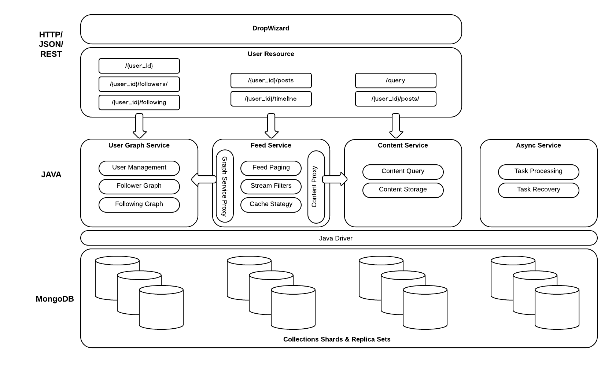
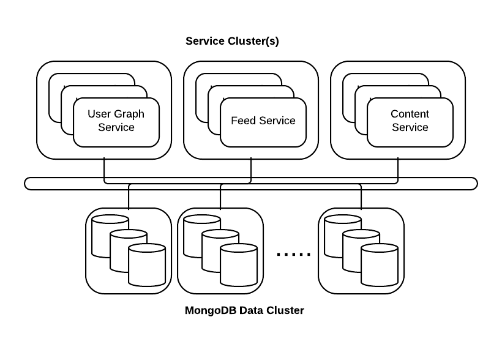

## High Level Architecture

Vertically, the basic architecture consists of the following stack :

1. **Dropwizard** - A high performance RESTful service layer based on Jetty, Jersey and Jackson. It provides a scalable, simple to configure frontend and the framework for binding the service interfaces to Java implementations. Dropwizard has great config, metrics, logging and other operational goodness, see more [here](http://dropwizard.github.io/dropwizard/).
2. **Java** - Each of the three main services discussed in this document are implemented in Java behind the [REST interface](rest.md).
3. **MongoDB** - for handling flexible content types and providing horizontal scale and high availability at the database layer, [MongoDB](www.mongodb.org) is a perfect choice. MongoDB also offers rich query/filtering capability which can be used for feed aggregation.

At the service layer, there are three distinct services :

1. **User Graph** - manages the creation/deletions of users in the system and the relationships between them. This service allows a user to “follow” another and will return information regarding who a user is following and who is following them.
2. **Content** - manages the primary storage for all content generated by users. All data posted to the feed service will be stored by this service, irrespective of what other destinations or caches it is routed to.
3. **Feed** - The feed service manages routing of content to all user feeds. A user posts content to the service and it will be routed to the stream of all other users based on follower relationships and other rules that define relevant content for the feed. The feed service uses a combination of caches, the graph service and the content service and provides an interface for accessing the feed of a user.

The three services are distinct components backed by their own MongoDB collections. The feed service leverages both the content and user graph via proxies that can be configured to use local in process services or call out to load balanced external clusters if necessary.

This design allows a flexible deployment model where the individual services can be scaled independently and in concert with their respective sharded MongoDB collections.

