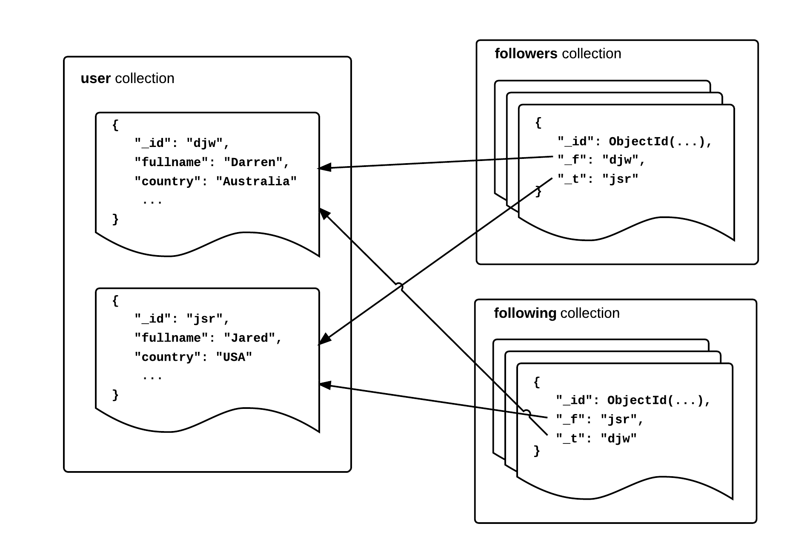

## User Graph Service

This service manages the users of the system and more importantly the follower graph. The interface is defined and documented in Socialite by [UserGraphService.java](https://github.com/darrenat10gen/socialite/blob/master/src/main/java/com/mongodb/socialite/services/UserGraphService.java). The service must allow users to be added and removed from the system and allow users to “follow” the posts of others.

The follower graph is also used for determining which user timelines receive the posts by any given author (the followers of that user). In many social networks, there can also be significant churn within the graph as users elect to follow and unfollow other users. For these reasons, this service must be carefully designed to scale to significant read and write loads.

### Schema Design

The Socialite UserService implementation (see [DefaultUserService](https://github.com/darrenat10gen/socialite/blob/master/src/main/java/com/mongodb/socialite/users/DefaultUserService.java)) uses 3 MongoDB collections by default called users, followers, following.

The **users** collection keeps track of the typical user entity data (the userId and any other details provided during the call to createUser).

In this collection, we use the _id field to store the userId for a number of reasons :

* The _id field must be unique which is a valid constraint for the userId
* The userId will most likely be indexed anyway, so we save updating a separate index
* The userId will make a good shard key for this collection as it will have a good distribution and again the _id index can be re-used for sharding

The graph service must also store relationships between users. Whenever a user follows someone, this information must be stored so that content posted by one account can be routed to the correct set of followers. There are a number of ways to implement this, one candidate would be to add this information to the users document like this :

    $ db.users.findOne()
    { 
        "_id" : "djw",
        "fullname" : "Darren Wood"
        "country" : "Australia",
        "followers" : [ "jsr", "ian”],
        "following" : [ "jsr", "pete"]
    }

A clear advantage of this approach is that all follower/following information for a user can be found by reading a single document, however there are some significant problems with the design :

* As followers are added, the document size will be changing. Resizing documents often incurs a write overhead in MongoDB.
* There is an ultimate limit to the number of followers a user can have as we approach the document size limit in MongoDB.
* It is very difficult to annotate an edge with this design. For example, say we wanted to arrange followed users into groups like friends, work, family etc. There is no natural place for this information to live.

The approach used by Socialite is to maintain separate collections for user “edge” data. These collections hold very simple relationship documents and utilize indices and covered queries to quickly retrieve follower lists.  As an example a small follower graph would look like this :

    $ db.followers.find()
    { "_id" : ObjectId("52e04dc3a0ee56ab3b097791"), "_f" : "djw", "_t" : "jsr" }
    { "_id" : ObjectId("52e70b8ba0ee2f6027130598"), "_f" : "djw", "_t" : "ian" }
    { "_id" : ObjectId("52e70b8ba0ee2f6047475774"), "_f" : "jsr", "_t" : "djw" }
    { "_id" : ObjectId("52e70b8ba0ee2f6027656375"), "_f" : "pete", "_t" : "djw" }

The query below will retrieve all of the followers for the “djw” user, note the projection to remove the _id field and return only the user id of the target follower(s) :

    $ db.followers.find({_f : "djw"}, {_id : 0, _t : 1})
    {"_t" : "jsr" }
    {"_t" : "ian" }

Also, checking some details of the explain() call shows us that the index placed on _f,_t is being used and that only the data in the index is required (avoiding the need to page in the entire document) :

    $ db.followers.find({_f : "jsr"}, {_id : 0, _t : 1}).explain().cursor
    BtreeCursor _f_1__t_1

    $ db.followers.find({_f : "jsr"}, {_id : 0, _t : 1}).explain().indexOnly
    true

Socialite also supports an API for retrieving the “following” list for a user. This can also be implemented in a number of ways and Socialite provides two options via configuration :

1. Reverse Index on Followers - Simply another index on the collection discussed above which is the reverse of the original (_t, _f), allowing for efficient queries in the opposite direction. This is an excellent option for a small user collection that will most likely not require sharding.
2. Separate “following” Collection - an entirely separate collection with the same information as the follower collection flipped around and indexed by the follower. Obviously, this requires that each relationship is inserted into two collections and incurs an overhead for both insert performance and storage size. The benefit is that for a very large user graph, these collections can be sharded by different keys which allows all queries to be targeted to a single shard no matter which direction the query is for.

Using relationship collections like this is also a flexible design. While Socialite implements a simple follower model of the user graph, it would be easy to implement other more complex models. For example, if we wanted to have arbitrary groups associated with follower relationships, we could simply add this information into the follower collection and filter by it as part of the follower query :

    $ db.followers.find()
    { "_id" : ObjectId("...791"), "_f" : "djw", "_t" : "jsr", "_g" : "work"}
    { "_id" : ObjectId("...598"), "_f" : "djw", "_t" : "ian", "_g" : "family"}
    { "_id" : ObjectId("...375"), "_f" : "pete", "_t" : "djw" , "_g" : "school"}

    $ db.followers.find({_f : "djw", "_g" : "family"}, {_id : 0, _t : 1})
    {"_t" : "ian" }

### Sharding

